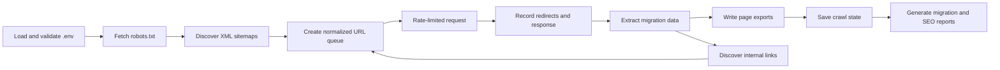

# Architecture

The project uses small CommonJS modules and a filesystem-based workflow. It does not require a database, queue service, browser by default, or application framework.

## Modules

- `scrape.js` starts the crawl and reports the final summary.
- `src/config.js` loads and validates environment variables.
- `src/url.js` resolves, normalizes, filters, and classifies URLs.
- `src/http.js` handles delays, retries, redirects, authentication, and timeouts.
- `src/robots.js` parses crawl rules and sitemap declarations.
- `src/sitemap.js` discovers pages from sitemap files and sitemap indexes.
- `src/extract.js` creates the migration page schema.
- `src/output.js` writes stable JSON, Markdown, CSV, and text outputs.
- `src/state.js` saves and restores crawl progress.
- `src/report.js` creates migration and SEO reports.
- `src/media.js` optionally downloads referenced media.
- `src/render.js` optionally renders JavaScript pages through Playwright.
- `src/crawler.js` coordinates discovery, crawling, extraction, exports, and reports.

## Crawl flow

## Design decisions

### Filesystem instead of a database

A migration crawl normally handles hundreds or a few thousand pages. JSON state and per-page files are simpler to inspect, copy, transform, and debug than a database.

### Normal HTTP by default

Axios and Cheerio cover traditional and server-rendered websites with low overhead. Playwright is optional because browser rendering is slower and uses more memory.

### One canonical page schema

The crawler exports one stable schema. WordPress, Next.js, Astro, Hugo, and custom CMS importers should transform that schema instead of adding platform-specific logic to the crawler.

### Bounded concurrency

Requests can overlap, but their start times are still rate limited. The default settings prioritize safety and reliability over crawl speed.
